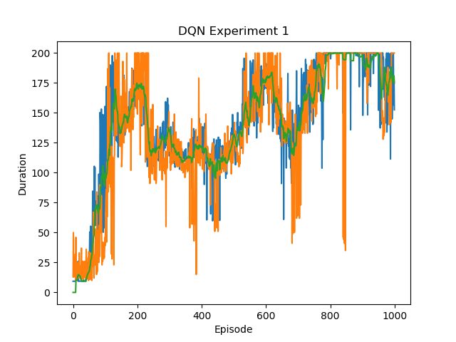
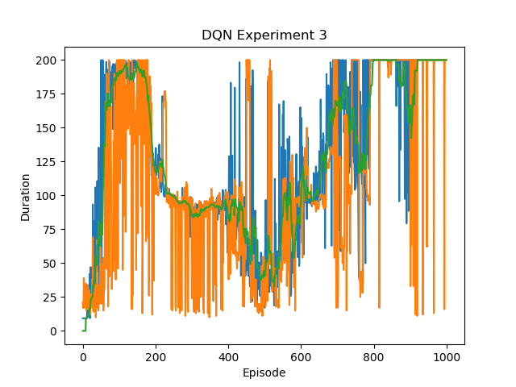
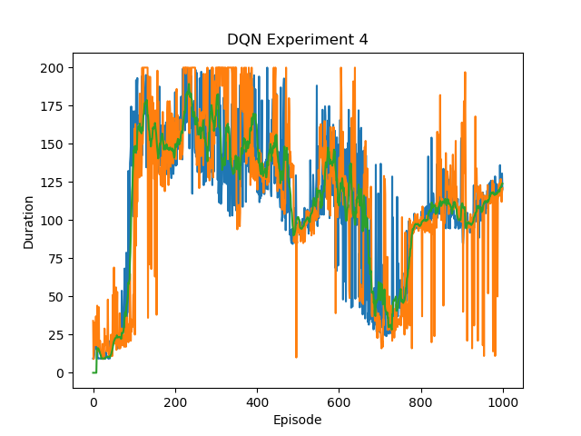
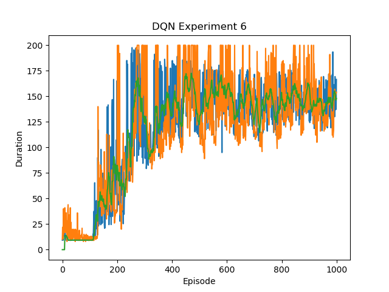
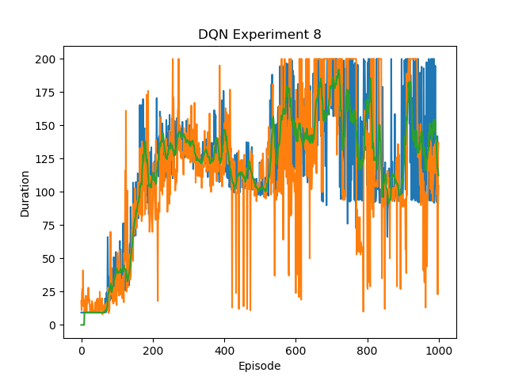

# Deep Q-Learning in PyTorch

This is a repository of DQN and its variants implementation in PyTorch based on the original papar.

## Algorithms

Algorithms below will be implemented in this repository.

**Deep Q Network (DQN)** from Playing Atari with Deep Reinforcement Learning, Mnih et al, 2013. [[arxiv](https://arxiv.org/abs/1312.5602v1)] [[summary](https://github.com/RPC2/DRL_paper_summary/blob/master/01%20Model-Free%20RL/001%20Playing%20Atari%20with%20Deep%20Reinforcement%20Learning.md)]

**Double DQN** Deep Reinforcement Learning with Double Q-learning, Hasselt et al 2015. [[arxiv](https://arxiv.org/abs/1509.06461)] [[summary](https://github.com/RPC2/DRL_paper_summary/blob/master/01%20Model-Free%20RL/004%20Deep%20Reinforcement%20Learning%20with%20Double%20Q-learning.md)]

**Dueling DQN** Dueling Network Architectures for Deep Reinforcement Learning, Wang et al, 2015. [[arxiv](https://arxiv.org/abs/1511.06581)] [[summary](https://github.com/RPC2/DRL_paper_summary/blob/master/01%20Model-Free%20RL/003%20Dueling%20Network%20Architectures%20for%20Deep%20Reinforcement%20Learning.md)]

**Prioritized Experience Replay (PER)** Prioritized Experience Replay, Schaul et al, 2015.  [[arxiv](https://arxiv.org/abs/1511.05952)] [[summary](https://github.com/RPC2/DRL_paper_summary/blob/master/01%20Model-Free%20RL/005%20Prioritized%20Experience%20Replay.md)]

## Methods

### DQN

The Q-network I use here is 3-hidden-layer perceptrons(MLP). The hidden_size is 32. The option of **dueling network** is also included.

```python
class DQN(nn.Module):

    def __init__(self, num_actions, input_size, hidden_size, dueling = False):
        super(DQN, self).__init__()
        self.num_actions = num_actions
        self.fc1 = nn.Linear(input_size, hidden_size)
        self.fc2 = nn.Linear(hidden_size, hidden_size)

        self.dueling = dueling
        if dueling:
            self.fc_value = nn.Linear(hidden_size, 1)
            self.fc_actions = nn.Linear(hidden_size, num_actions)
        else:
            self.fc3 = nn.Linear(hidden_size, self.num_actions)
    
    # Called with either one element to determine next action, or a batch
    # during optimization. Returns tensor([[left0exp,right0exp]...]).
    def forward(self, x):
        x = x.view(x.size(0),-1)
        if not self.dueling:
            x = F.relu(self.fc1(x))
            x = F.relu(self.fc2(x))
            x = self.fc3(x)
        else:
            x = F.relu(self.fc1(x))
            x = F.relu(self.fc2(x))
            v = self.fc_value(x)
            a = self.fc_actions(x)
            x = a.add(v - a.mean(dim=-1).unsqueeze(-1))
        return x
```

The corresponding policy action is generated by -greedy method. is exponentially  decayed w.r.t. a designated decay rate.

When evaluating the performance of the model, I wrote a class method called `demo`. `demo` basically plays the game for 100 times by exploiting the actions generated by the policy network (equivalent to  = 1.0), and get the average score of the games as the score of the current policy network.

The policy network scores, average scores of the past 10 versions of policy network, and the current episode duration are plotted.

## Experiments and Results

```python
# typical hyperparameters
class AgentConfig:
    EXPERIMENT_NO = 10

    START_EPISODE = 0
    NUM_EPISODES = 500
    MEMORY_CAPA = 10000
    MAX_EPS = 1.0
    MIN_EPS = 0.01
    UPDATE_FREQ = 10
    
    LR = 25e-5          # learning rate
    DECAY_RATE = 0.99   # decay rate
    BATCH_SIZE = 32     # batch size
    GAMMA = 0.99        # gamma

    DOUBLE = False      # double Q-learning
    DUELING = False     # dueling network
    PER = False         # prioritized replay

    RES_PATH = './experiments/'

class EnvConfig:
    ENV = "CartPole-v0"
```

Below are the experiments to test DQN under different circumstances. In the plot,

*Blue line:* policy network scores

*Orange line:* the current episode score under greedy policy

*Green line:* average scores of the past 10 versions of policy network

### Integrated Agent


### DQN

| No.  | learning rate | decay rate | batch size |   gamma   | result.png                       | Comments                                                     |
| :--: | :-----------: | :--------: | :--------: | :-------: | -------------------------------- | ------------------------------------------------------------ |
|  1   |     5e-4      |    0.99    |     32     |   0.99    |  | Solved the game after around 800 episodes.                   |
|  2   |   **1e-4**    |    0.99    |     32     |   0.99    |  | Small learning rate makes the network hard to learn anything. Not converging at all. |
|  3   |   **1e-3**    |    0.99    |     32     |   0.99    |  | Solved the game after around 200 episodes. Displayed a pattern of high probability of divergence due to high learning rate. |
|  4   |     5e-4      |    0.99    |   **64**   |   0.99    |  | Bigger batch size counter-intuitively leads to worse performance. |
|  5   |     5e-4      |    0.99    |   **16**   |   0.99    |  | Smaller batch size makes the  policy stay in high performance but much more noise. |
|  6   |     5e-4      |    0.99    |   **8**    |   0.99    |  | Smaller batch size makes the  policy stay in high performance but much more noise. |
|  7   |     5e-4      |    0.99    |     16     | **0.999** |  | Higher gamma means preservation of the past learned knowledge. Solved the game around 100 episodes, and stayed there for around 80 episodes. |
|  8   |     5e-4      |    0.99    |     16     |  **0.9**  |  | Lower gamma leads to high variations of the performance.     |
|  9   |     5e-4      | **0.999**  |     16     | **0.999** |  | Higher decay rate affects the epsilon greedy policy score but not the policy net score. Solved the game at around 175 episodes. |

## References

- [DRL_paper_summary](https://github.com/RPC2/DRL_paper_summary)
- [Spinning Up in Deep RL](https://spinningup.openai.com/en/latest/)

